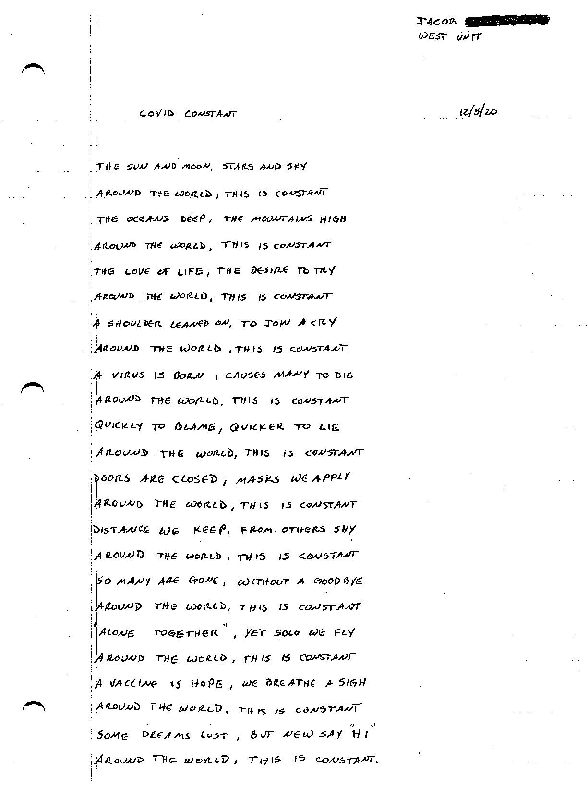

# EXECUTIVE SUMMARY

The COVID-19 pandemic has changed the world forever. On a scale never seen before, humanity has experienced a collective trauma. Thanks to technology we have unprecendented access to data around spread, mortality rates, vaccines, and more. Also thanks to technology, we have seen the faces of the pandemic from every corner of the globe. There is a population in the United States, however, that has struggled to get their experiences with this devastating pandemic out to the public. 

[As of December 2020, the rate of COVID-19 among prisoners in the United States was 4 as high as than the general population.](https://www.themarshallproject.org/2020/12/18/1-in-5-prisoners-in-the-u-s-has-had-covid-19) Even as the first Americans began getting their vaccines, the spread in prisons showed no signs of slowing. According to Homer Venters, the former chief medical officer at New York’s Rikers Island jail complex, those numbers are an under count. Because of crowded conditions, prisoners cannot social distance, and don't recieve proper care from the medical staff inside. This is why data collection and sharing these numbers is so important. 

[The data for this project](https://data.world/associatedpress/marshall-project-covid-cases-in-prisons/workspace/file?filename=covid_prison_rates.csv) is collected by The Associated Press and The Marshall Project,  a nonprofit investigative newsroom dedicated to the U.S. criminal justice system. It is collected weekly by Marshall Project and AP reporters who call the facilities to get "the cumulative number who tested positive among staff and prisoners, and the numbers of deaths for each group."

### Modeling Methodology:

This project will examine the timeseries data for the state of New Jersey and will try to estimate future positive tests based on past data using a linear time series model.

The data is limited at times, with prisons systems unable/unwilling to share data in some instances. 

### Problem Statement:

I will complete a seires of univariate, time-series regressions to forecast positive COVID-19 cases among incarcerated people in the state of New Jersey. The evaluation metrics will be root mean squared error and R-squared scores. The baseline will be a linear time-series model with 1 lag and I will aim to improve this model by 5%.

### Statistical Analysis:

I created 2 different linear time series regressions - 1 with 1 lag, and 1 with 2 lags. Lagging the data refers to moving the data back 1 unit in order to correlate the data with itself and is also knowns as Serial Correlation. 

The lags I created were used in Autocorrelation and Partial Autocorrelation plots to help determine the relationship the data has with a lagged version of itself. The Partial Autocorreclation proved that 1 lag would probably be enough to model on. Adding 2 lags did not prove to help linear model performance.

The ARIMA model is an attempt to improve the baseline model. I tested the data with the Augmented Dicky Fuller test, and the data demonstrated stationarity in its original version, so I did not difference it for the ARIMA model. I chose a q-value of 3 because it decreased the RMSE score. In the end, the R2 was still 0, so I was unable to utilize it in prediction. 

### Dashboards
The dashboards were created to help understand how the data differs from state to state.

[Maps](https://public.tableau.com/shared/HQ2X2GB84?:display_count=y&:origin=viz_share_link)
[Rates](https://public.tableau.com/profile/meryl1401#!/vizhome/Covid-19-USPrisons_2/Rates)
[Presentation]()