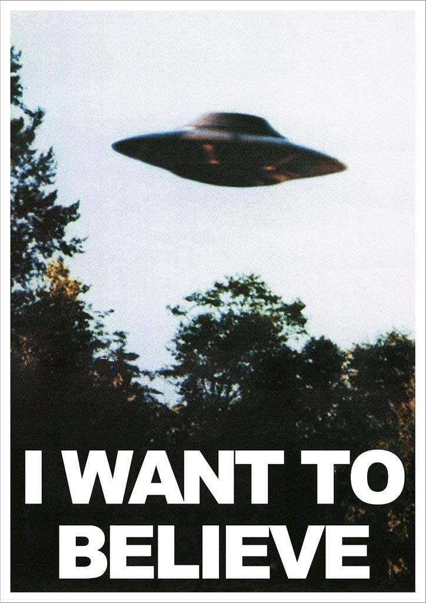

### American Conspriacy: A Textual Analysis of Online Conspiracy Theories and the People They Affect

## Executive Summary 

Do you believe?

Conspriacy Theories are about as American as apple pie. They have existed since the times of the first colonies; from UFOs to shadow corporations and CIA coverups, conspiracies tend to come to fruition during times of immense social change (Merlan, Anna. (2019). *Republic of Lies: American Conspiracy Theorists and Their Surprising Rise to Power*. Metropolitan Books).  

Qanon is a relatively new conspiracy theory that includes satanism, pedophilia-rings controlled by the Democratic Party, and Donald Trump ousting  and arresting the global elite. Q claims to be a high-level government whistleblower and spreads harmful misinformation via internet message boards, popular conspiracy theorists such as Alex Jones, and even a member of congress.

This project aims to analyze the 2 subreddits r/Conspiracy and r/QanonCasualties, and creates machine learning models to predict the subreddit the text belongs to. This will help us analyze two things: 
 1) how people tend to speak when it comes to conspiracy theories (which key words indicat conspiratorial thinking?)
 2) how the conspiracy theories affect the family and friends of those whoe believe, specifically the Qanon classification (what do the friends and family of Qanon believers reach     out for help on?)

### Methodology
This project utilzes a Logistic Regression to pull interpretable coefficients, and (separately) a Random Trees Classifier to help predict which subreddit a title belongs to. We split the data into training and testing sets, and fit the model based on the training data. We then test the unseen data and will review accuracy scores. 

### Future Plans for this Data
This project analyzes the overall sentiment of the subreddits, and finds important words and phrases to identify those seeking help with Qanon conspiracies, and those who are discussing general conspiracy. These words will help us create an app in the future that will analzye the text to help the user idenitfy patterns. These patterns will tell us if a friend or family member is falling into the Qanon conspiracy, and give tips and techniques to help bring them back to rational thinking. 

Sources:
 https://www.politico.com/news/2021/01/15/feds-edge-closer-to-sedition-charge-459573
 https://variety.com/2020/digital/news/facebook-bans-qanon-trump-conspiracy-group-1234728644/
 https://conspirituality.net/wellness/how-to-talk-about-conspiracy-theories-w-anna-merlan/
 https://en.wikipedia.org/wiki/Dog_whistle_(politics)
 https://en.wikipedia.org/wiki/QAnon
 https://www.reddit.com/r/QAnonCasualties/wiki/glossary
